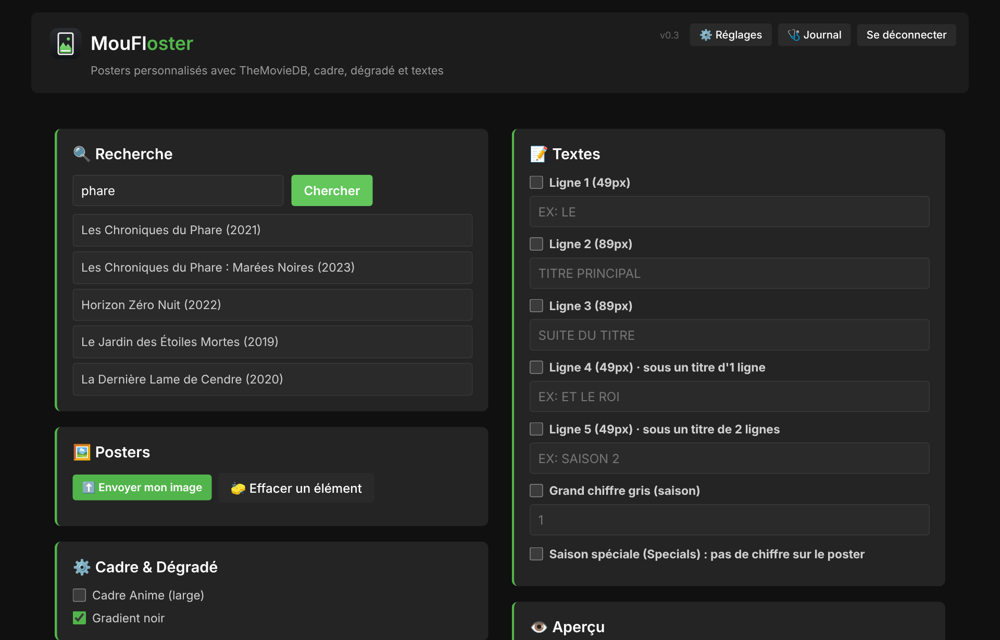
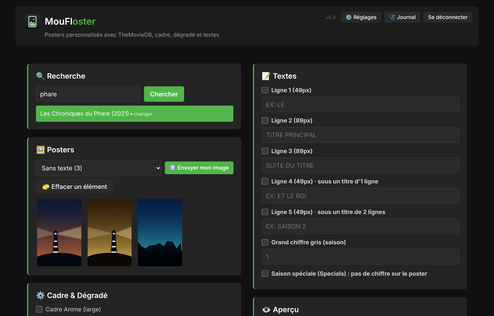
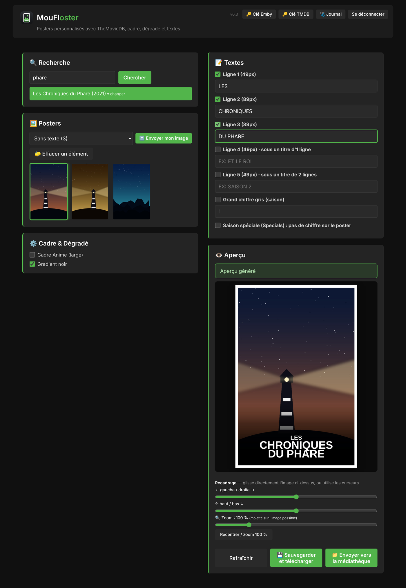
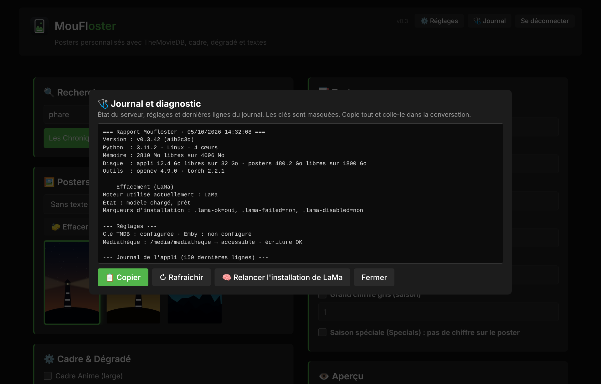
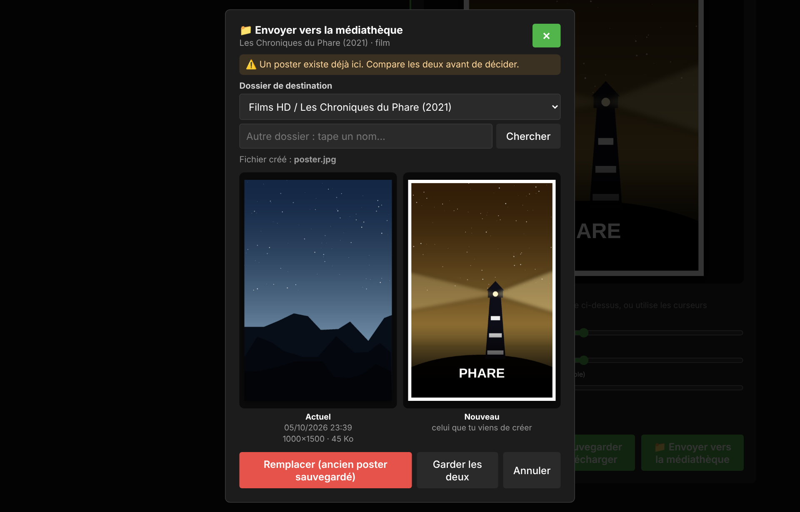
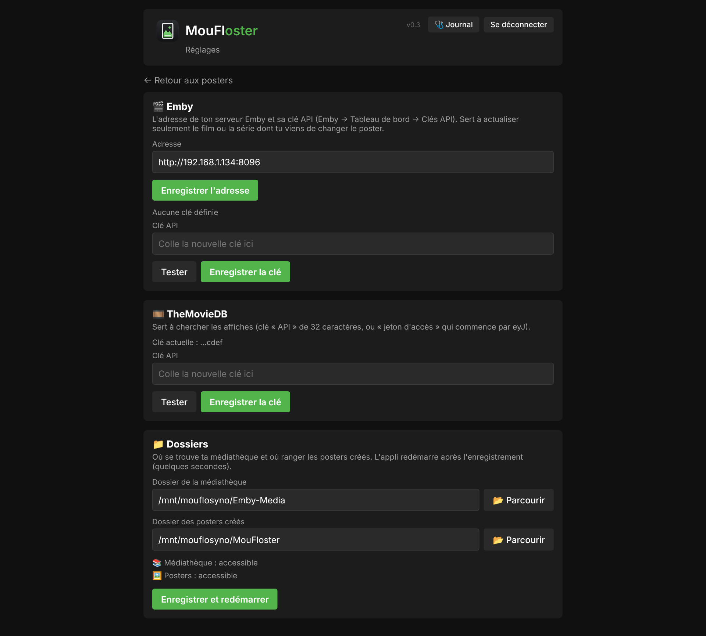
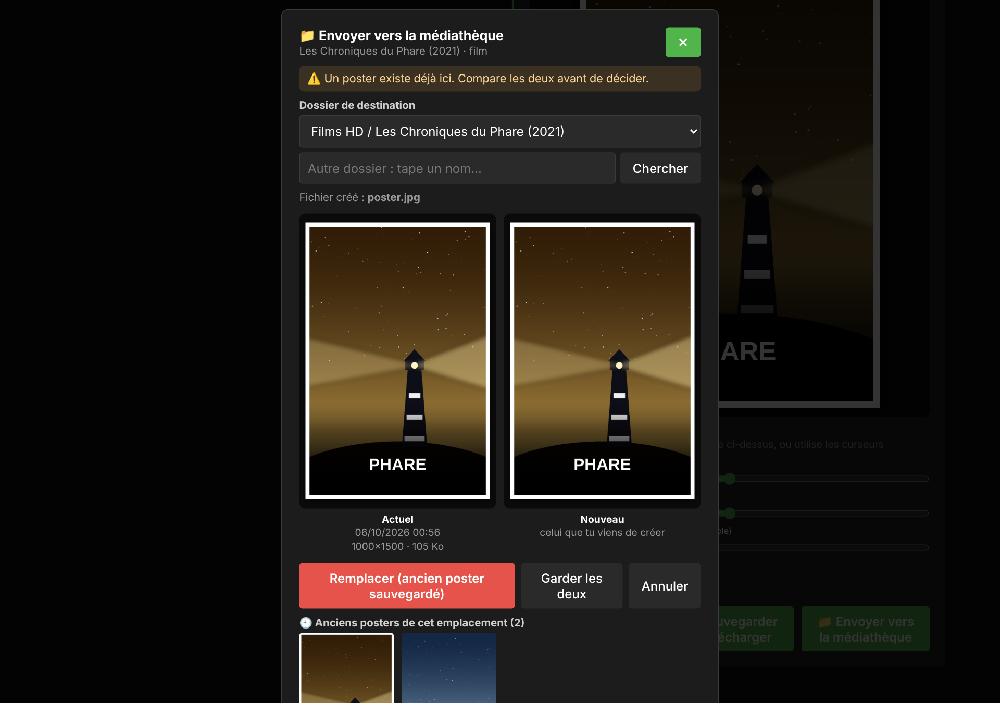
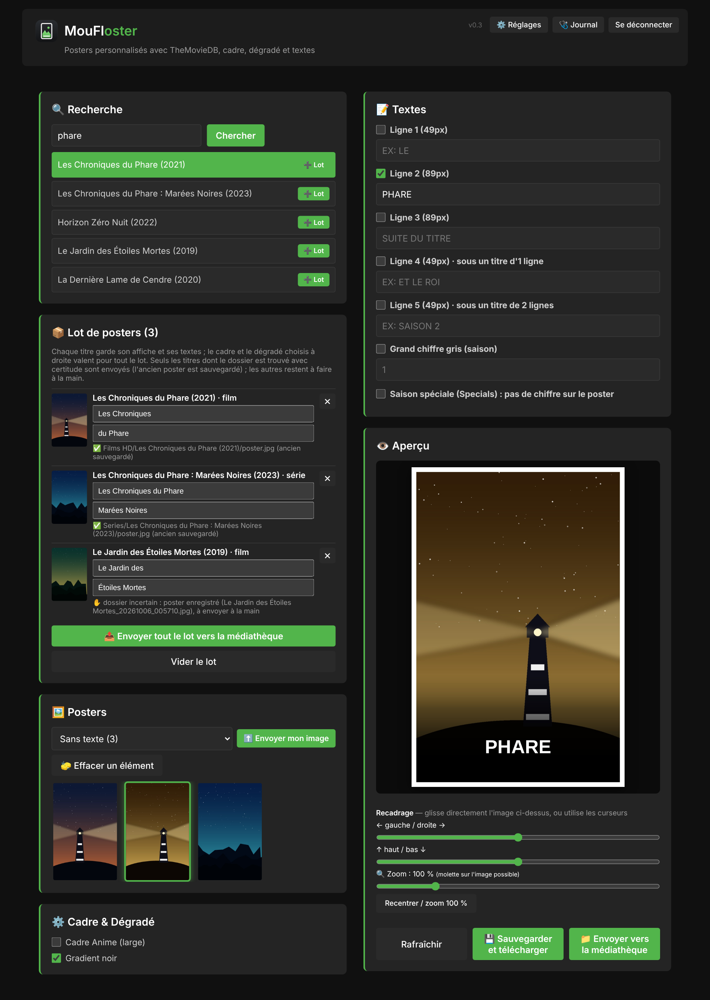
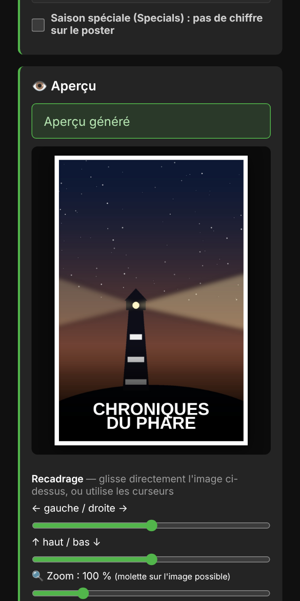

# 🎬 MouFloster - Générateur de posters TheMovieDB

Interface web manuelle pour télécharger et personnaliser des posters de films/séries depuis TheMovieDB, avec support des calques personnalisés (cadre blanc, dégradé noir, textes).

Pour l'installation sur le serveur, le déploiement automatique et la
reconstruction complète après une migration/panne, voir [`INSTALL.md`](INSTALL.md).

## 📸 Aperçu

*Captures avec des données de démonstration.*

**La recherche d'un film ou d'une série**



**Le choix de l'affiche, avec le filtre de langue**



**Cadre blanc, dégradé noir, textes et aperçu final**



**La fenêtre « Journal » pour comprendre une panne**



**L'envoi vers la médiathèque : ancien et nouveau poster côte à côte**



**La page ⚙️ Réglages : adresse et clé d'Emby, clé TheMovieDB, dossiers**



**Les anciens posters d'un emplacement, à restaurer d'un clic**



**Le lot de posters : plusieurs titres envoyés d'un coup**



**Sur téléphone**



## ✨ Fonctionnalités

- 🔍 **Recherche TheMovieDB** : Cherche films/séries, affiche les résultats
- 🖼️ **Sélection de posters** : Affiche les posters sans langue, choix manuel
- 🎨 **Personnalisation des calques** :
  - Cadre blanc (Anime 60px ou Standard 40px)
  - Gradient noir transparent
  - 5 couches de texte configurable (49px et 89px)
  - Numéro de saison/épisode
- 👁️ **Aperçu en temps réel** : Vois le résultat immédiatement
- 💾 **Sauvegarde JPEG** : Exporte tes posters personnalisés (1000×1500 px)
- 🕘 **Restaurer un ancien poster** : chaque remplacement garde l'ancien poster ; la fenêtre d'envoi les montre et en remet un d'un clic (le poster actuel est sauvegardé avant)
- ♻️ **Reprendre une mise en page** : affiche, recadrage, zoom, textes, cadre et dégradé sont retenus à chaque enregistrement ; en rouvrant le titre, « Reprendre la dernière mise en page » remet tout comme avant
- 📦 **Lot de posters** : « ➕ Lot » sur plusieurs résultats, une affiche et deux lignes de titre par film/série, puis « Envoyer tout le lot » (seuls les dossiers trouvés avec certitude sont remplacés, anciens posters sauvegardés ; les autres restent à faire à la main)
- 📚 **Sagas** : cherche aussi les sagas TheMovieDB (« Harry Potter - Saga »…) ; leur affiche est envoyée directement dans la collection Emby correspondante (l'ancienne affiche est sauvegardée dans `_anciens-posters/_sagas`)
- 📖 **Couverture dans MouFlanga** : « 📚 Couverture dans MouFlanga » met le poster en couverture d'une série de la bibliothèque de mangas MouFlanga (sans Emby) ; la série est reconnue d'après le titre, l'ancienne couverture est sauvegardée dans `_anciens-posters/MouFlanga`. Depuis MouFlanga, « 🎨 Créer avec MouFloster » ouvre MouFloster avec la recherche faite et un bouton pour revenir
- ✏️ **Image perso sans recherche** : pour un manga sans anime (pas d'affiche TheMovieDB), tape juste le nom puis « ⬆️ Envoyer mon image »
- 📨 **Alertes Telegram** : redémarrage après un plantage ou une coupure du serveur, erreur pendant une action, lot de posters terminé, mise à jour installée (cases à cocher dans ⚙️ Réglages ; réglages Telegram repris de MouFlanimeXer, sujet de groupe propre à MouFloster)
- 🎵 **Générique manquant** : après l'envoi d'un poster, si le film ou la série n'a pas encore de générique, une fenêtre propose d'ouvrir MouFlopening directement sur ce titre (adresses dans ⚙️ Réglages → MouFlopening)
- ⚙️ **Page Réglages** : adresse et clé d'Emby, clé TheMovieDB et dossiers se règlent depuis le navigateur (même page que dans MouFlopening et MouFlanimeXer)

## 📋 Prérequis

- Python 3.8+
- Compte gratuit TheMovieDB (pour l'API)
- Connexion Internet

## 🚀 Installation

### 1. Clone le repo
```bash
git clone https://github.com/mouflo/moufloster.git
cd moufloster
```

### 2. Installe les dépendances
```bash
pip install -r requirements.txt
```

### 3. Configure ta clé TheMovieDB
Le plus simple : ouvre l'appli puis **⚙️ Réglages** et colle ta clé (elle reste sur le serveur, jamais sur GitHub). En ligne de commande :
```bash
export TMDB_API_KEY="ta-clé-api-ici"
export OUTPUT_DIR="/chemin/vers/sortie"
```

[Obtenir une clé](https://www.themoviedb.org/settings/api) (gratuit)

### 4. Lance l'appli
```bash
python app.py
```

Ouvre http://localhost:5000 🎉

## 💡 Utilisation

1. **Recherche** → Tape un titre
2. **Sélection** → Clique sur un résultat, puis choisis un poster
3. **Perso** → Active les calques et configure le texte via les checkboxes
4. **Aperçu** → Vois le résultat en temps réel
5. **Sauvegarde** → Clique « Sauvegarder »

## 📐 Spécifications

| Paramètre | Valeur |
|-----------|--------|
| Largeur | 1000 px |
| Hauteur | 1500 px |
| Police petite | 49 px |
| Police grande | 89 px |
| Cadre Anime | 60 px |
| Cadre Standard | 40 px |
| Format sortie | JPEG 95% qualité |

## 🔧 Configuration avancée

Les dossiers et les clés se règlent dans **⚙️ Réglages**. Ils sont enregistrés dans `data/secrets.env` (jamais sur GitHub). Équivalent en ligne de commande :
```bash
bash set-secret.sh TMDB_API_KEY "ta-clé"
bash set-secret.sh OUTPUT_DIR "/dossier/sortie"
bash set-secret.sh MEDIATHEQUE_DIR "/chemin/mediatheque"
```

**MouFlanga** : dans ⚙️ Réglages → MouFlanga, colle l'adresse de MouFlanga et la clé API générée dans MouFlanga → ⚙️ Réglages → MouFloster (marche aussi si MouFlanga est sur une autre machine). Sans réglage, si MouFlanga est installé sur le même serveur, la couverture est copiée directement dans son dossier des mangas (lu dans `/opt/mouflanga/data/secrets.env`).

## 📂 Structure

```
moufloster/
├── app.py              # Application Flask principale
├── requirements.txt    # Dépendances Python
├── README.md          # Ce fichier
└── .gitignore         # Fichiers ignorés par Git
```

## 🐛 Dépannage

**Port 5000 utilisé ?**
```python
# Modifie dans app.py :
app.run(port=8000)  # Autre port
```

**Pas de posters ?**
- Vérifie ta clé TMDB
- Essaye avec un titre populaire ("Dune", "Breaking Bad")

**Module introuvable ?**
```bash
pip install --upgrade flask pillow requests
```

## 🗺️ Feuille de route

- [ ] Auto-classification dans Emby/Jellyfin
- [ ] Polices personnalisées

## 📝 Licence

Code sous licence MIT (voir `LICENSE`) : réutilisable librement. Images de TheMovieDB (usage non-commercial).
Les polices Arial ne sont **pas** fournies (licence Monotype/Microsoft) : voir « Polices » dans `INSTALL.md`.

---

**Besoin d'aide ?** Ouvre une « issue » sur GitHub ou demande à Claude ! 🤖

---

*Dans la même famille que MouFlanimeXer et MouFlopening, centré sur la création de posters avec réglages manuels.*
